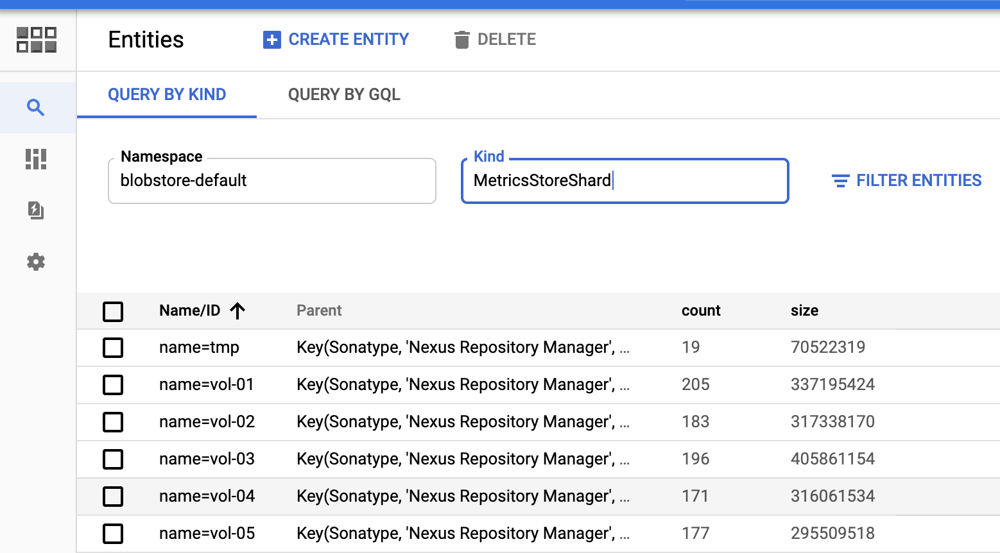
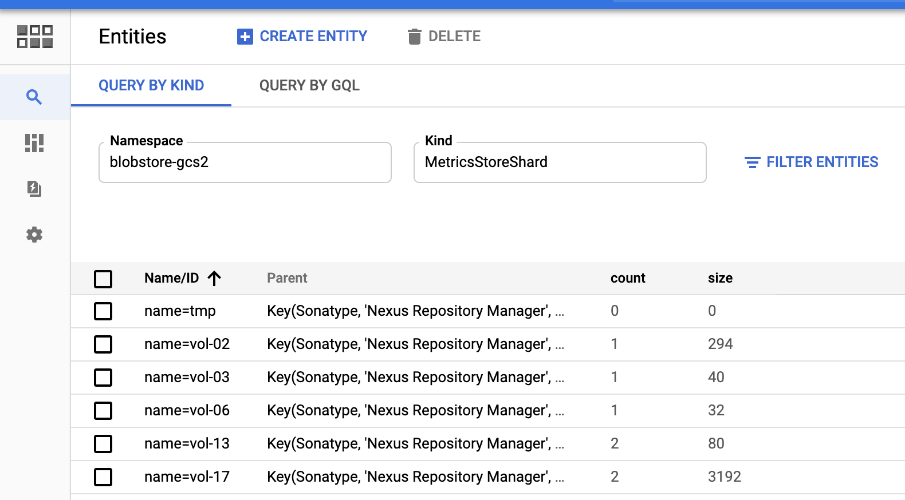

<!--

    Sonatype Nexus (TM) Open Source Version
    Copyright (c) 2017-present Sonatype, Inc.
    All rights reserved. Includes the third-party code listed at http://links.sonatype.com/products/nexus/oss/attributions.

    This program and the accompanying materials are made available under the terms of the Eclipse Public License Version 1.0,
    which accompanies this distribution and is available at http://www.eclipse.org/legal/epl-v10.html.

    Sonatype Nexus (TM) Professional Version is available from Sonatype, Inc. "Sonatype" and "Sonatype Nexus" are trademarks
    of Sonatype, Inc. Apache Maven is a trademark of the Apache Software Foundation. M2eclipse is a trademark of the
    Eclipse Foundation. All other trademarks are the property of their respective owners.

-->
# Leveraging Google Cloud Datastore for Blobstore metadata

## Definitions

Blobstore metadata is defined by two types of data:

* the index of *soft-deleted blobs*, and
* the count of blobs and their total size in bytes.

This design document focuses solely on those two.

**Soft-deleted blobs** are entries in the Blobstore that Repository Manager has marked for deletion but has not
yet reclaimed. Soft deletion is a Blobstore design concept that is carried over from the original Filesystem
implementations. 
 
This design document will not apply to the metadata attached to the blobs themselves (.properties files).
 
## Context

Getting an accurate count of all blobs and their total size in a Blobstore in real time is computationally 
very expensive. Querying the underlying storage for a count and full size on demand is not possible. 

The BlobStore create and delete operations wrap the `Inputstream` of content with a byte counter. Adds/removes
to these counters are performed using Java concurrent counters internally, and periodically flushed to a single source.

The original Filesystem implementation of Blobstore has the reference implementation. 
This implementation stores the count and totalSize in a text file that looks like:

```
#Fri Jun 28 19:07:33 CDT 2019
totalSize=22240
blobCount=30
```

The Object Storage backed blobstore implementations (S3, this plugin, and Azure) have borrowed the same implementation, 
simply replacing the read/write from disk with an appropriate HTTP operation to/from the Object Storage.

Pros to Metrics File approach?

* Portable between blobstore implementations
* Easy to read quickly and parse
* Small impact on the underlying storage (a single 3 line text file).

Cons to Metrics file approach

* Tricky to get consistency right.
* In HA-C environments, we have a separate file per node, then logic to aggregate the results on read.
 
## Design Goals for Google Cloud Blobstore Metadata

1. Get accurate and consistent values for the number of blobs and their total size in bytes.
2. Preserve the dissociation of the time to track changes to the size and count from the Blobstore create and delete operations.
3. Leverage Google Cloud native services to store size and count in a cost efficient manner.

## Implementation

We aim to replace the existing Metrics file backed implementation as while it is cost efficient, it does not
achieve goals #1 and #2.

### Index of Soft-Deleted Blobs

Releases from 0.2.0 on have used Google Cloud Datastore for soft deleted blobs.

The previous implementation simply stored each BlobId marked for deletion with the Kind `DeletedBlob` in the default 
namespace with no key hierarchy.

In order to organize this content, a new key hierarchy is established, the follows this model:

```
 namespace=blobstore-[BlobStoreConfiguration.getName()]
 kind=Sonatype,name=Nexus Repository Manager
 --> kind=DeletedBlob
```

The absence of the blobstore's name in the hierarchy meant previous implementations of the blobstore would not support
more than one instance in a repository manager deployment without cross-contamination of blobstore deleted blob 
indexes.

This new key hierarchy allows multiple blobstores to be present within the same repository manager deployment with
clear separation between deleted blob indexes.

### Blob count and total size

If we stored a single total size and count in a single datastore key/value, that will create a hotspot that won't 
perform very well. [Google Cloud Datastore best practices](https://cloud.google.com/datastore/docs/best-practices) 
offers a model to follow for this described as a "Sharded Counter".

The idea is that we shard our size and count counters across a number, then aggregate them as needed. We can
even use a projection query to return those values easily for summation.

The implementation of Blobstore Metrics uses a similar key hierarchy:

```
 namespace=blobstore-[BlobStoreConfiguration.getName()]
 kind=Sonatype,name=Nexus Repository Manager
   --> kind=MetricsStore
   ------> kind=MetricsStoreShard,name=directpath [size=2048,count=2]
   ------> kind=MetricsStoreShard,name=tmp [size=2048,count=2]
   ------> kind=MetricsStoreShard,name=vol-01 [size=2048,count=2]
   ------> kind=MetricsStoreShard,name=vol-02 [size=0,count=0]
   ------> kind=MetricsStoreShard,name=vol-03 [size=123456,count=11]
   ...
```

Based on the current strategy for partitioning blobs, there will be 49 total shards (directpath, tmp, and vol-01 through 
vol-47).

In order to calculate the total size and total counts, we can execute a projection query against the MetricsStoreShard
Kind to retrieve those fields, and sum the rows. In this implementation, we execute two queries separately: one for the 
size and one for the count. This is done for two reasons:

* Running a single projection query for both fields would require a composite index. There isn't currently a way
to programmatically setup an index via the Java SDK, so this would present difficulty for NXRM deployers.
* These simple projection queries are considered "Small Operations" and 
[have zero financial cost](https://cloud.google.com/datastore/pricing) 

These project queries achieve design goals #1 (accurate and consistent) and #3 (cost-effective).

Writing to these entities each and every time we perform a create or delete is not desirable for a number of reasons:

* Writing the metrics would add to the total round trip time to create or delete a blob
* Reading the total metrics from the blobstore is a very infrequent operation.
* Google Cloud Datastore does have limitations on how frequently we write to these entities. 

The File Blobstore implementation does not attempt to update the blobstore metrics on every write; deltas are 
accumulated in memory and written out to disk periodically.

[ShardedCounterMetricsStore](../src/main/java/org/sonatype/nexus/blobstore/gcloud/internal/ShardedCounterMetricsStore.java) 
takes a similar approach. A thread safe Queue is kept in memory to track all deltas, and a periodic task drains those 
deltas to the Datastore every 5 seconds.
This queue allows us to achieve design goal #2 (no drag on create/delete).

### Results

In this example, we have two Google Cloud Storage backed blobstores, `default` and `gcs2`: 


In Google Cloud Console, under Datastore, we can see the metadata for `default`: 


Similarly, the metadata for `gcs2`: 


If your NXRM instance (and Google Cloud project) only hosts one blobstore, the `Namespace` dropdown will not
be displayed in the Datastore console.

### Summary of benefits to Datastore approach

* Reads and writes of blobstore metadata are isolated from BlobStore content activity
* Simplified aggregation for HA-C environments
* Improved consistency of count and totalSize metadata
* Zero financial overhead

### Shortcomings

There is one circumstance where blobstore count and size metadata may be inconsistent.

* If there are queued deltas from Blobstore create/delete operations that have been flushed, and the JVM exits
unexpectedly, those deltas will be lost.

Mitigations:

* Orderly shutdown of Nexus Repository Manager will wait for a flush of these deltas to occur.
* We have set a flush frequency of 5 seconds; this value is chosen to be frequent enough to reduce the impact of this
obscure occurrence and fit well within Google Cloud's recommendations for write frequency for Datastore.
